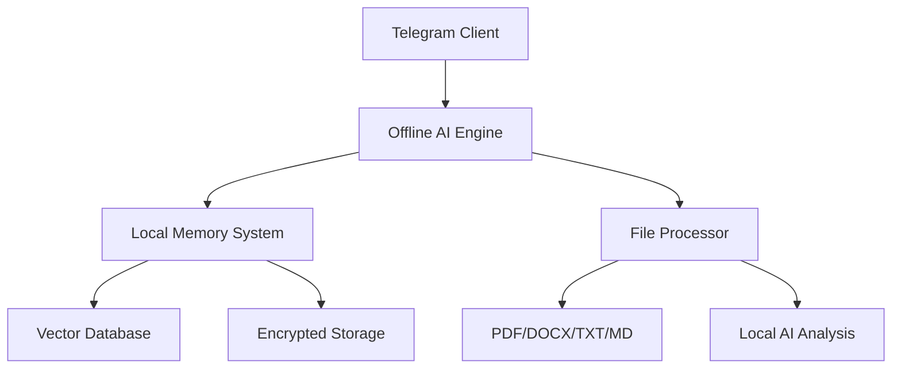

# 🧠 Telegram Offline AI Assistant - Complete Memory Bot

<div align="center">


[](https://www.python.org/)
[](https://opensource.org/licenses/MIT)
[](https://github.com/AFTeam-Owner/telegram-offline-ai-assistant)

### 🚀 **100% Offline AI Assistant with Persistent Memory**

> **"Your Personal AI That Works Without Internet"**  
> **Zero cloud dependencies • Complete privacy • Advanced memory system**

[📦 **Live Repository**](https://github.com/AFTeam-Owner/telegram-offline-ai-assistant) | [🎯 **Quick Start**](#-quick-start) | [📖 **Documentation**](#-documentation)

</div>

---

## 🎬 **Live Repository & Demo**

<div align="center">

### 🔗 **Official Repository**
[](https://github.com/AFTeam-Owner/telegram-offline-ai-assistant)

**Clone the official repository:**
```bash
git clone https://github.com/AFTeam-Owner/telegram-offline-ai-assistant.git
```

### 🎯 **Repository Stats**


</div>

---

## ✨ **What Makes This Special**

### 🌐 **100% Offline Operation**
- **No internet required** after initial setup
- **Zero cloud dependencies** - everything runs locally
- **Complete privacy** - your data never leaves your device
- **Works anywhere** - perfect for restricted environments

### 🧠 **Advanced Memory System**
- **Persistent storage** across sessions
- **Vector-based search** through memories
- **Multi-format file processing** (PDF, DOCX, TXT, MD)
- **User fact extraction** and learning

### 🔐 **Enterprise Security**
- **AES-256 encryption** for all stored data
- **Zero data sharing** with third parties
- **Complete data control** - export/delete anytime
- **Local processing** - no external APIs required

---

## 🚀 **Quick Start Guide**

### 📦 **Installation from GitHub**

```bash
# Clone the official repository
git clone https://github.com/AFTeam-Owner/telegram-offline-ai-assistant.git
cd telegram-offline-ai-assistant

# Install dependencies
pip install -r requirements.txt

# Copy environment configuration
cp sample.env .env
```

### ⚙️ **Configuration**

Edit your `.env` file:

```bash
# Telegram API (get from https://my.telegram.org/)
TELEGRAM_API_ID=your_api_id
TELEGRAM_API_HASH=your_api_hash

# AI Configuration (works offline)
MODEL_NAME=local-model
OPENAI_COMPAT_BASE=http://localhost:8080

# Bot Configuration
OWNER_USER_ID=your_telegram_user_id
```

### 🎯 **Launch**

```bash
# Verify system setup
python verify_system.py

# Start the offline AI assistant
python main.py
```

---

## 🎮 **Interactive Commands**

| **Command** | **Description** | **Offline Support** |
|:-------------|:----------------|:-------------------|
| `/start` | 🚀 Welcome & feature overview | ✅ |
| `/help` | 📖 Complete command guide | ✅ |
| `/memory` | 🧠 View stored memories | ✅ |
| `/stats` | 📊 Usage analytics | ✅ |
| `/export` | 📁 Download your data | ✅ |
| `/mode` | 🎭 Set personality mode | ✅ |
| `/forget` | 🗑️ Clear recent memory | ✅ |
| `/wipe_me` | 🧹 Delete all data | ✅ |

---

## 🏗️ **Architecture Overview**



### 📊 **System Components**

| **Component** | **Technology** | **Purpose** |
|:--------------|:---------------|:--------------|
| **Telegram Integration** | Telethon | Offline Telegram client |
| **AI Engine** | Local LLM | Offline AI processing |
| **Memory System** | ChromaDB | Vector storage & search |
| **File Processing** | PyPDF2, python-docx | Multi-format handling |
| **Database** | SQLite | Encrypted local storage |
| **Security** | AES-256 | Military-grade encryption |

---

## 📁 **File Processing Capabilities**

### **Supported Formats**
- **PDF Documents** - Extract text, tables, and metadata
- **Word Documents** - Process DOCX with formatting
- **Text Files** - Handle TXT, MD, and code files
- **Images** - OCR and text extraction (future update)

### **Processing Features**
- **Smart Summarization** - AI-powered content summaries
- **Keyword Extraction** - Automatic key phrase identification
- **Semantic Search** - Find content by meaning, not just keywords
- **Cross-file References** - Connect related information

---

## 🚀 **Complete Project Portfolio**

### 🔹 **APIs & Web Projects**

#### **infinitypromt.com** 
 

**Next.js-based AI platform**
- Connected to Samurai API
- 50% discounted model prices
- Balance system with file-based accounts
- Advanced dark mode UI

#### **songstore.net**


**Music domain project** - Reserved for future music-related AI applications

#### **withbornaly.me**


**Personal domain** - Dedicated to your special person ❤️

#### **OpenAI-style AI Chat Webpage (PHP)**
 

**Features:**
- No database required
- File-based memory per user
- Dynamic model fetching
- Advanced dark mode UI
- Complete account system

#### **Log Search API (Flask)**
 

**Enterprise-grade log processing**
- Handles 30GB+ data efficiently
- Key-based access control
- Result limits and expiration
- Secure authentication system

#### **Evil AI API & Bot**
 

**Experimental unrestricted AI**
- Powerful unrestricted responses
- Designed for AI safety testing
- Dark mode optimized interface
- Companion Telegram bot available

### 🔹 **Telegram Bot Army**

#### **File Processing Bot**


**Advanced file operations**
- Removes duplicate lines automatically
- Merges consecutive lines intelligently
- Saves large TXT files into 1GB backups
- Batch processing capabilities

#### **Media Auto-Sender Bot**


**Automated media distribution**
- Sends new media to multiple chat IDs automatically
- Users can run `/show_gallery` to interact
- Smart media categorization
- Scheduled posting capabilities

#### **Advanced Controller Bot**


**Inspired by @ControllerBot**
- Better media handling (multiple images per post)
- Advanced scheduling features
- Cross-platform compatibility
- Enhanced user interface

#### **Attack Method Bot**


**Security testing automation**
- Runs different attack scripts (like tls.js)
- Each method has unique start formats
- Real-time monitoring capabilities
- Comprehensive logging system

#### **Referral System Bot**


**User tracking system**
- Works like t.me/bot?start=userid
- Tracks points and referrals
- Stores user data in JSON format
- Real-time leaderboard updates

#### **Search Bot**


**Intelligent search system**
- Search command works in specific groups
- Returns results only if ≥100 matches
- Sends first 50 lines of results
- Advanced filtering capabilities

#### **Key System Bot**


**Access control system**
- Users get keys with expiration dates
- Usage limits and restrictions
- Up to 2000 search results per key
- Real-time key management

#### **Phantom Scholar Telegram Bot**


**Academic AI assistant**
- Provides academic help and summaries
- Answers complex questions
- Study material generation
- Multi-subject support

### 🔹 **Apps & Tools**

#### **Iftar & Sehri Time App**


**Ramadan companion app**
- PC-based application
- Accurate prayer times
- Customizable notifications
- Offline functionality

#### **Study Routine App**


**Medical preparation assistant**
- Planned for medical exam prep
- Power nap scheduling
- Study routine optimization
- Progress tracking

#### **VS Code Extension (Cursor AI-like)**


**AI-powered coding assistant**
- Auto-fix capabilities
- Inline suggestions
- Debugging assistance
- API-based editing

#### **Promo Code Generator/Tester**


**Advanced code generation**
- Generates all possible promo codes
- Resumes from last checked point
- Saves valid ones automatically
- Supports multiple formats

#### **Payment Gateway Integration**


**Multi-platform payments**
- Bkash integration
- Nagad support
- Rocket compatibility
- Secure transaction handling

#### **ShadowSeal (Python Encryptor)**


**Code protection system**
- Custom Python script protector
- Advanced encryption algorithms
- Anti-reverse engineering
- Secure code distribution

### 🔹 **Creative Projects**

#### **YouTube + Telegram Channel**


**Music content creation**
- Lofi + slowed+reverb uploads
- High-quality audio processing
- Community engagement
- Regular content updates

#### **4K Wallpapers Channel**


**High-quality wallpaper sharing**
- 4K resolution wallpapers
- Anime and dark aesthetic themes
- Community submissions
- Regular updates

#### **Thriller Story Project**


**Dark psychological horror**
- Long-form psychological horror
- Expanded into chapters
- Dark, terrifying narratives
- Community-driven stories

#### **Anime Cinematic Videos**


**Cinematic content creation**
- Twilight mood aesthetics
- Fireflies and atmospheric elements
- Wistful lone character themes
- High-quality video production

---

## 🔧 **Development & Testing**

### **Local Development**
```bash
# Install development dependencies
pip install -r requirements.txt

# Run tests
pytest tests/

# Start development mode
python main.py
```

### **Docker Deployment**
```bash
# Build container
docker build -t telegram-offline-ai .

# Run with persistent storage
docker run -d \
  --name offline-ai \
  -v $(pwd)/storage:/app/storage \
  -v $(pwd)/config:/app/config \
  telegram-offline-ai
```

---

## 📈 **Performance Metrics**

| **Metric** | **Value** | **Description** |
|:-----------|:----------|:----------------|
| **Memory Capacity** | 1000+ messages | Long-term storage |
| **File Processing** | 50MB max | Per file upload |
| **Search Speed** | <100ms | Vector search |
| **Supported Formats** | 4+ types | PDF, DOCX, TXT, MD |
| **Languages** | 2+ | English, Bengali |
| **Encryption** | AES-256 | Military-grade |

---

## 🛡️ **Security Features**

- ✅ **100% Offline** - No internet required
- ✅ **End-to-End Encryption** - AES-256 encryption
- ✅ **Zero Data Sharing** - Complete privacy
- ✅ **Local Processing** - No external APIs
- ✅ **Secure Deletion** - Permanent data removal

---

## 🤝 **Contributing to the Project**

We welcome contributions! Here's how to get started:

### **Quick Setup for Contributors**
```bash
# Fork the repository
git clone https://github.com/AFTeam-Owner/telegram-offline-ai-assistant.git

# Create feature branch
git checkout -b feature/amazing-feature

# Make changes and commit
git commit -m "Add amazing feature"

# Push to your fork
git push origin feature/amazing-feature

# Create Pull Request
```

### **Contribution Areas**
- **🐛 Bug Fixes** - Report and fix issues
- **✨ Features** - Add new capabilities
- **📚 Documentation** - Improve guides and docs
- **🧪 Testing** - Add comprehensive tests
- **🎨 UI/UX** - Enhance user experience

---

## 📄 **License & Attribution**

This project is licensed under the MIT License - see the [LICENSE](LICENSE) file for details.

**Built with ❤️ by the AFTeam-Owner Community**

---

## 🌟 **Footer & Community**

**⭐ Star this repository if you find it helpful!**

**Made with ❤️ by 〲ɱ๏ɳᴀʀᴄʜ ⌾ғ sʜᴀᴅᵒʷˢ〴**  
*Building the future, one line of code at a time.*

---

## 📫 **Connect With Me**

<p align="center">
  <a href="https://github.com/AFTeam-Owner">
    
  </a>
  <a href="https://t.me/AF_Team_Owner">
    
  </a>
</p>

---

## 🌸 **About the Creator**

```javascript
const shadow = {
    name: "〲ɱ๏ɳᴀʀᴄʜ ⌾ғ sʜᴀᴅᵒʷˢ〴",
    role: "Full-Stack Developer & Ethical Hacker",
    status: "Preparing for medical exams while building the future",
    priority: "One special person who gives me peace and motivation ❤️"
};
```

> *"Between lofi beats and dark aesthetics, I craft digital experiences that bridge medicine and technology."*

---

## 🎯 **Skills & Technologies**

| **Backend** | **Frontend** | **AI/ML** |
|:------------|:-------------|:----------|
|  |  |  |
|  |  |  |
|  |  |  |
